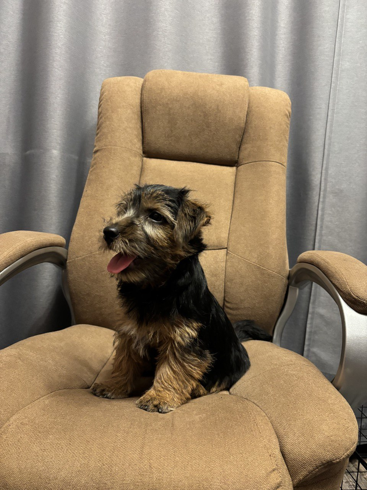

# My Q1 2025 in a Nutshell 🌰

## Work:

## Open Source Projects: 2 Born, 3 Fleshing Out 🥩

I continue my open-source development efforts. In Q1, I've started two projects: `confi` helping you with configuration management and `persic` containing various persistence (read database) related stuff. 3 projects (`nist`, `versy`, and `nice-shell`) received some updates, improvements, and new functionality.

The most developed so far is NIST (a Non-toxic REST brother) You can check it out on [Github](https://github.com/astorDev/nist)! I would appreciate if you give it a star! ⭐

## Blogging: Record-Breaking Monthly Views 👁️

In January I've received the record 5.7K monthly viewes. The month was so fruitful partially because in that month I've published my most popular Q1 article "WebSockets in .NET 9: A Getting Started Guide". You can check it out [here](https://medium.com/@vosarat1995/websockets-in-net-9-a-getting-started-guide-3ea5982d3782).

In general I continue to publish content regularly, focused mostly on .NET-related stuff. With just 1 out of 9 articles non involving .NET in any way. The outstanding article is about software versioning, if you were wondering.

## Personal: Got A Puppy! 🐕

Meet Thor, 

Me and my wife now have a new furry family member! As a nomad family, we were looking for a nice and travel-friendly dog. After days of investigation my wife suggested a Norfolk Terrier. The breed was extremely hard to find, we couldn't find a single nursery in Georgia, where we reside. 

But finally here's our little boy! 

