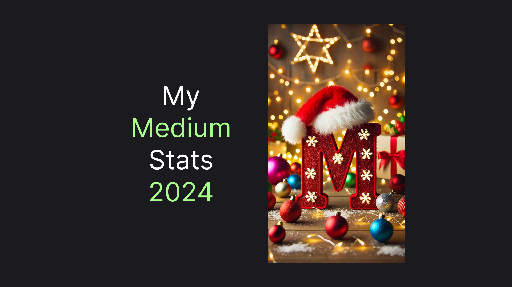

# My 2024 on Medium

With 2024 coming to an end it's time to reflect on the Medium articles I wrote this year: what went good, what went bad, what was surprising, and what I learned. I grouped my articles into 4 categories, so let me walk you through them one by one.

## 🦄 Category 1. C# and .NET

Well, I'm a professional C# developer, so it is not surprising that this category is the most popular. Surprises came from the performance of a few articles, with some having disappointedly low performance, while others exceeded expectations. Let's talk about each of them one by one. 

### [Exception Handling in ASP.NET Core](https://medium.com/p/9fded06f8ec1) 

~10 views. Well, I published the article not so far ago, so the numbers could be deceiving. The article looks very similar to the most performant articles as it covers the fundamental gaps in ASP .NET Core, suggesting a pretty universal solution.

### [Web3 With C#: A Practical Example](https://medium.com/p/a713cf3ddb63)

~50 views. A colleague of mine recently sent me this article, with a message "Look, what I've bumped into!". This was both pleasant and ironic since this is the least-read C# article I have. The modest amount of views is also surprising having that the hype around web3 didn't seem to disappear and the bitcoin was at the time of writing constantly testing the all-time high.

### [.NET Timers: All You Need to Know](https://medium.com/p/d020c73b63a4)

~200 views. The .NET ecosystem is pretty weird. ASP .NET Core is, in my opinion, the GOAT of Web Api frameworks. It's extremely well-documented and thought-through. But when it comes to background services Microsoft just leaves us with "You'll figure it out". Well, in this article, I've tried to do just that. I understand why it doesn't have many views, the whole domain of background jobs seems to be undiscovered so it's hard to find people there. But there is nothing else left other than keep walking the path.

### [Creating Strongly-Typed API Clients in .NET](https://medium.com/p/d87a3d7ef016) 

250+ views. As with exception handling, this article is pretty new, so the numbers may not properly reflect the interest. I personally think the topic is very important since the situation with http services clients is also very weird. We do have a pretty good and flexible `HttpClient` infrastructure. Still, there's no guide on how to use it to get a full client for a specific API. Well, the article is my attempt to make one.

### [.NET Configuration Architecture: AppSettings](https://medium.com/@vosarat1995/net-configuration-architecture-appsettings-a0a718e8e8e1)

~400 views. This is the least viewed article from the configuration articles cycle. Unlike the other articles, this one focuses more on architecture. It tries to clarify how appsettings are frequently misused and proposes an alternative architectural approach. I would probably get more views if I've named it something like "You are using `appsettings.json` wrong .NET!", but I'm a little allergic to clickbait, so we'll have what we have.

### [How C# Dictionary Actually Works](https://medium.com/@vosarat1995/how-c-dictionary-actually-works-47f3a156055b)

~500 views. The article idea was born when I couldn't answer an in-depth question about a dictionary in a job interview. Well, now I can and hopefully, this article could help you, too. Honestly, I expected a little bit more views on this article since it involves a fundamental topic, which is also relatively common for an interview. But again we have what we have

### [.env in .NET](https://medium.com/p/aa0a8dc4b68c)

600+ views. This is another article about configuration. Although I'm a little allergic to click-bait I do like fancy names - gladly, the short name didn't stop the articles from getting a solid number of views. In my view, .env files are the only missing part in a default .NET configuration, so this is fortunate that there's an interest in this topic.

### [Kafka with C# and .NET: Getting Started](https://medium.com/@vosarat1995/kafka-with-c-and-net-getting-started-81c72fbba5bb)

750+ views. Well, the article kind of stands by itself. It gave me solid views, but I needed Kafka just once and there is probably not much left to say. I would say the article is the result of me writing a "Getting Started" doc instead of Kafka engineers. But hey, someone should've done that.

### [.NET Configuration Architecture: Getting Started](https://medium.com/@vosarat1995/net-configuration-architecture-getting-started-87526b9fbc68)

~800 views

### [Making Your OpenAPI (Swagger) Docs UI Awesome in .NET 9](https://medium.com/p/67fbde6b71b5)

1300+ views. That's kind of funny that this article is in the top 4. Of course, I do recommend having Swagger for basically everyone, still writing the articles was a little bit boring. Also, for this article, the credits are due to Nick Chapsas, as the fundamentals of the articles are from his video. In the article, I just filled the gaps I found both in the Scalar docs and in the video.

### [JSON Logs in C# and .NET](https://medium.com/@vosarat1995/json-logs-in-c-and-net-335009e3a984)

1600+ views. There is not much to say about this article. It took Microsoft a few releases to give us a JSON logger, yet it was not very well done. So in this article, I've presented the problems I have and gave an alternative and I think the views are pretty proportional to the impact.

### [Request-Response Logging in ASP .NET Core](https://medium.com/@vosarat1995/request-response-logging-in-asp-net-core-edbb09075149)

4600+ views. Here comes the titan. Here the story is very similar to the JSON logs article. Just filling the gaps in ASP .NET Core and getting solid views for that. 

### [Environment Variables in ASP .NET Core](https://medium.com/@vosarat1995/environment-variables-in-asp-net-core-d6b4ea6cff9f)

5200+ views. And here comes the GOAT. The story is about the same for the last 3 articles. But the thing is that this is highly scalable as there are not many things Microsoft does poorly with ASP .NET Core. Ironically, as a .NET developer, I hope that the articles will become obsolete in the future. That is a little terrifying, but I believe I will find something even more complex and vital to fix.

### Summary

Those 13 articles in total brought 16'000+ views, exceeding the total number of views in all other categories. Of course, in the next year, I will continue this category - it is my craft after all. You can probably expect longer and more holistic articles in the upcoming year. 

## 🐦 Category 2. Flutter

I use a pretty uncommon tech stack. Unfortunately, there are not many jobs that expect such a combination of backend and frontend technology. However, since I'm also developing my personal projects I need a technology that will allow me to create mobile apps. I spent a lot of time experimenting with various mobile development platforms, including native. But nothing gave me even close satisfaction in terms of development experience. 

In this category, article views are even more volatile and unpredictable than with C#. So, let me walk you through the situation here.

### [Flutter Animations: Getting Started](https://medium.com/@vosarat1995/flutter-animations-getting-started-300a1ed679cc)

~20 views. Ironically, that's the article I had the most hopes for. In my view, Flutter's official guides on animation are very twisted and unclear. So I decided to make my own version. Well, it seems like the topic is not really interesting, though I have no idea. Anyway, moving on...

### [Deploying Flutter Web with Docker](https://medium.com/@vosarat1995/deploying-flutter-web-with-docker-50ae07d9d7e3)

~50 views. Well, here the situation is a little bit more expected, since probably not many people use Flutter for web development.

### [PWA with Flutter](https://medium.com/@vosarat1995/pwa-with-flutter-369998c5ec81)

~60 views. Similarly, PWA seems kind of a niche topic for the Flutter community. Although the article helped structure my own thoughts around the topic there is so little information on this topic on the web that most of the things in the article could be figured out only through an experiment.

### [Releasing a Flutter IOS App: My AppStore Story](https://medium.com/@vosarat1995/releasing-a-flutter-ios-app-my-appstore-story-bdf933a57e17)

~60 views. Here the performance is somewhat expected since there is no clear search request leading to the article. Yet I like the article since it is both a personal story and a technical walkthrough.

### [Flutter DropdownMenu In-Depth](https://medium.com/@vosarat1995/flutter-dropdownmenu-in-depth-49e316779599)

~100 views. Here mediocre performance comes as a surprise. `DropdownMenu` is a relatively new widget, coming as a replacement for `DropdownMenuButton`. Still, on the web, there is much more information about the old widget, so I thought a deep article about the new one has the potential to become a hit. Apparently, it doesn't work that way.

### [Flutter Overlay: Getting Started + CompositedTransformFollower](https://medium.com/@vosarat1995/flutter-overlay-getting-started-compositedtransformfollower-a14a569e5dfa)

~200 views. The article title sounds pretty technical and complicated. Yet it attracted more people than the `DropdownMenu` article. Anyway, that's an important article, too.

### [Flutter Tabs: TabBar and TabBarView.](https://medium.com/@vosarat1995/flutter-tabs-tabbar-and-tabbarview-861fd45b3532)

~250 views. Although the article itself is not very complicated I feel like I've spent a lot of time to come up with a technical solution, underlining this article. I'm glad it paid off with a solid amount of views.

### [Customizing CupertinoDatePicker in Flutter](https://medium.com/@vosarat1995/customizing-cupertinodatepicker-in-flutter-e032aeccbe50)

1800+ views. Here goes the champ! I'm not sure what is so different about CupertinoDatePicker that it brought so many views, but I still appreciated the attention.

### Total

With 8 articles I get a total of 2'800+ views here. Notably, the most performant article here gave almost twice as all the other articles in the category. 

Although, I'm a fan of Flutter the number of articles is likely to shrink in the next year. It's just the case that I have a lot going on right now and may not have time for my personal project and this is the only place where I use Flutter

## 🐳 Category 3. DevOps and Infrastructure

Besides coding, both my job and my personal project require some DevOps efforts. I'm often surprised by the quality of tutorials and guides in this category. So, from time to time, I write my own. Here the number of views is almost always the opposite of my perception of article values. Let me demonstrate it:

### [Talking Shell Scripts: An Architectural Journey](https://medium.com/@vosarat1995/talking-shell-scripts-an-architectural-journey-6d0c642b0613)

~15 views. The article talks about architecturing a system of multiple shell scripts. I couldn't find anything on that on the web so I came up with my own thing. The article obviously didn't take off - perhaps the title should be less cryptic. It also has a few lord of the ring punchlines and ...well, I'm not doing that again 🙂

### [Marketplacing a Shell GitHub Action](https://medium.com/@vosarat1995/marketplacing-a-shell-github-action-c021eb74e951)

~30 views. This is a relatively simple tutorial on creating a shell-based GitHub Action and publishing it to the marketplace. Again maybe I should've made the title less cryptic. 

### [Nginx and Docker: Getting Started](https://medium.com/@vosarat1995/nginx-and-docker-getting-started-d32d9d6cbb95)

~40 views. Here I have no idea what went wrong. I still feel like the topic should be pretty universal and the other articles out there are mostly poorly written. Maybe nginx is just not as widely used as I thought, or interesting only for a particular group of people for whom the "getting started" sounded embarrassing. Anyway, the article at least helps me to put my own thoughts together.

### [Advanced Docker Logs with Filebeat and Elasticsearch​](https://medium.com/@vosarat1995/advanced-docker-logs-with-filebeat-and-elasticsearch-30073166a68e)

~230 views. Here performance got significantly better. In my mind, the views are deserved, not much to say here.

### [Elastic Stack with Docker getting started. Elasticsearch, Kibana, and Filebeat.](https://medium.com/@vosarat1995/elastic-stack-with-docker-getting-started-elasticsearch-kibana-and-filebeat-ebe75fd13041)

~450 views. The article is a pair of the previous one, just with slightly more technologies involved. Surprisingly it didn't scare people, and quite the contrary brought more people in.

### [PostgreSQL Hostings Prices (some are free)](https://medium.com/@vosarat1995/postgresql-hostings-prices-some-are-free-397c88cc847d)

~1000 views. It's ridiculously hard to find a non-bs article about any product. Most of the information on the web is promotional, hardly curated, and seems AI-generated. No wonder an honest article got a significant number of reads. Well, I was picking something on my own but decided to share the list with the world. Gladly it paid off.

### [Postgres VS Mongo: Performance Comparison for semi-structured data](https://medium.com/@vosarat1995/postgres-vs-mongo-performance-comparison-for-semi-structured-data-9a5ec6486cf6)

1600+ views. Last but not least, is the performance comparison article. I was afraid the over-technical title would scare some people away. Gladly, it seems like the honest and specific title worked very well in contrast to my expectations. So here's the unexpected winner of the category.

### Total

The 7 articles in the category brought me **3'300+** views in total. As I described the distribution is very odd for me. I think in the upcoming year the pace will be about the same. I'm also not stopping with the unpopular articles, since they at least let me put my thoughts and knowledge on the topic together. And with this category, it's really hard to figure out what will take off.

## Category 4. Others: General Computer Science, Scrum, Productivity

It's hard to describe the last category. I write about anything that occupies my head. Although the views are very moderate, only articles in this section I feel could be long-lasting. By long-lasting I mean that even my grandchildren could find something interesting.

Perhaps, I'm doing something wrong with the titles, though. Or it's just much harder to grab attention on such broad topics as it's way more competitive. Anyway, here are my thoughts about the articles in this section:

### [My mind-calming tactic](https://medium.com/@vosarat1995/inbox-my-fresh-productivity-tool-7213c89b64be)

~10 views. This is my only attempt into writing about productivity, so far. As you may see, it's doing poorly. Well, I'm not too proud of the article to be honest. The title is also cryptic as in this period I was trying to go for mysterious titles. Well, you'll probably see another attempt for me in the next year.

### [Binary to text encoding: Hex](https://medium.com/@vosarat1995/binary-to-text-encoding-hex-03c8449ff08a)

~10 views. That's the first article in the cycle about computer science fundamentals. I should've probably framed it slightly differently. Even I can't tell what's the article about looking at the title - that's probably something I should take care of if I want to continue with such an article. And spoiler alert: I do.

### [Scrum Main Pitfall with ChatGPT](https://medium.com/@vosarat1995/scrum-main-pitfall-with-chatgpt-be9da50a8bf9)

~10 views. This was a fun experiment. I was trying to formulate my thoughts about the blind spot of Scrum. I tried ChatGPT to formulate an article and I decided to make the article as my comments on ChatGPT thoughts. Well, this is one of the articles where I thought embedding a trending thing would boost the view, but the reality was quite the opposite.

### [I Got Kicked Out Of the AppStore. Now What?](https://medium.com/@vosarat1995/i-got-kicked-out-of-the-appstore-now-what-0208e7b945e7)

~10 views. Here I expected that the views would be mediocre. The article is about my personal project and my relationships with the AppStore. I don't know if it was possible to make the article more interesting to a broader audience, but here we go.

### [Bitcoin Cryptography Beyond Blockchain.](https://medium.com/@vosarat1995/bitcoin-cryptography-beyond-blockchain-fc3b3d4e7ed1)

~10 views. This article was probably the most mind-boggling to write. It finally completed my understanding of the way Bitcoin works. Again I expected the word bitcoin to attract slightly more people. But it was very interesting, regardless of the views.

### [How I Started My 3-Year Software Development Side Hustle](https://medium.com/@vosarat1995/how-i-started-my-3-year-software-development-side-hustle-f4aae0fc3cad)

~25 views. This is another personal article. It performed just slightly better, I guess that's due to the more elaborate article. Even with the mediocre views, I guess the cool part is that I should be able to show this article through generations to come. I guess it could still be relevant to my grandchildren let's say. With this perspective, the views doesn't seem to mean that much.

### [Microservice Architecture Case Study: Hidden Category](https://medium.com/@vosarat1995/microservice-architecture-case-study-hidden-category-2c134562bdc1)

~30 views. This is also an article I bet more on. I think that's a great starting point for a discussion on how to organize data exchange in a microservice architecture. The topic is personally intriguing to me, so I'd most likely change the approach, but continue articles on the topic.

### [How to talk in 1s and 0s?](https://medium.com/@vosarat1995/how-to-talk-in-1s-and-0s-e3d8a852a2b0)

~80 views. This is also a topic on basic computer science. Gladly, here the views are at least slightly better. It was also important for me to scratch my head around a topic like that. It also gave me a little more insight into the topic.

### [Code documentation: Drawings VS Pseudo-Code VS Bulletpoints VS Mermaid](https://medium.com/@vosarat1995/code-documentation-drawings-vs-pseudo-code-vs-bulletpoints-vs-mermaid-d6fa86c4a7f4)

~90 views. This is the only article this year, which changed my own perspective on things. To write the article I conducted an experiment comparing the methods of creating a software system architecture description. My personal bet was on hand drawing. Yet, the most boring tool of bullet points came first. Now, I always remind myself to not overcomplicate documentation. Text is the King!

### [Best Postman Alternative](https://medium.com/@vosarat1995/best-postman-alternative-5890e3e9ddc7)

~300 views. In a C# section, I mentioned how odd that there are no common best practices for creating an http client. This is even more surprising when we talk about language-agnostic tooling. This article is a tribute to my favorite tool: HttpYac. Besides giving the tool basics I also discovered some new techniques of the tool I didn't know before starting the article.

### [Material 3 (You) Typography Cheatsheet](https://medium.com/@vosarat1995/material-3-you-typography-cheatsheet-ffc58c540181)

~840 views. This is the only well-read article where the main audience is not programmers. Initially, I thought this article would mostly attract someone with Flutter stack. Unexpectedly, the article was mostly useful for designers. There's not much to say about the article itself - I mostly structured the typography information from the official website into a compact and visual cheatsheet.

### Total

Here with 11 articles I only got 1'400+ views. As in the previous section, the actual views are almost reversed from what I expected. 

Here the next year's challenge is probably to continue writing about the thing that bothers me, yet finding a way to make it sound more interesting for other people. This section wraps up the main part of the article, but let me say just a few final words!

## To the Next Year!

So, what's next? Well, most of the time I write about a problem I am facing right now: be it in my job, with my personal project, or just something that occupies my head for other reasons. With that in mind, this is my forecast for each category:

- **`C#` and `.NET`** - Perhaps nothing would change globally (It's the most performant category, after all). But with the foundation I built, I'll be able to explain more holistic solutions I have, so long-form articles are coming!
- **Flutter**. Although the category also performs well the platform is not something I use commercially. So there's a chance I will not be able to find so much time for Flutter - there will likely be fewer articles on that.
- **DevOps**. We'll see how much I will be involved with such things in the next year. For now, it seems like nothing significant is going to change, so the article's pace will stay roughly the same. Perhaps, something should change about the way I present articles since some are getting less traction than I expected. But I don't have anything specific in mind.
- **Others**. Despite being the category being a loser of 2024 I will unlikely give up on it. Maybe I should tune the way I structure those articles. You will definitely see me experimenting with new approaches in the upcoming year, but again I have nothing specific to tell you yet.

Have something you want to read about from me or have some advice? I would be very happy to hear it and collaborate. And ... claps are appreciated, too! 👉👈

See you in the next year! 🎄

---

### Total Views

| Month         | Views   | Reads  |
|---------------|---------|--------|
|**March**      | 13      | 6      |
|**April**      | 73      | 35     |
|**May**        | 204     | 135    |
|**June**       | 1600    | 1000   |
|**July**       | 1600    | 1000   |
|**August**     | 3500    | 2200   |
|**September**  | 4400    | 2600   |
|**October**    | 4200    | 2400   |
|**November**   | 3400    | 2000   |
|**December**   | 4500    | 2800   |
|-------------- |---------|--------|
|**Total**      | ~23500  | ~14000 |
